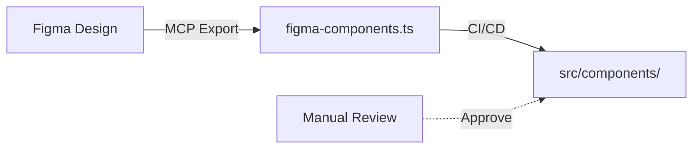
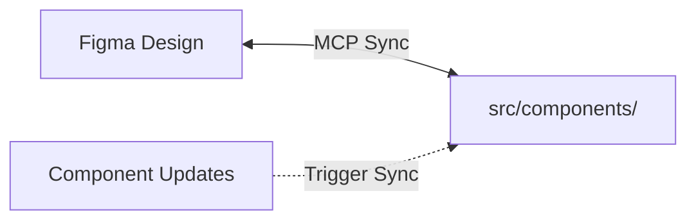

# SFS Figma ↔ Code MCP Integration Guide

**Purpose:** Enable real-time sync between Figma designs and codebase via Model Context Protocol  
**Status:** Ready for implementation  
**Scope:** SmartFlowSite → All 26 SFS repositories

---

## 🎯 QUICK START

### 1. Enable Figma MCP in Claude/Cursor

```bash
# Option A: Claude.ai (built-in if Figma connector enabled)
Settings > Connected Tools > Figma > Enable

# Option B: Cursor IDE
.cursor/models.json:
{
  "mcp_servers": [
    {
      "type": "figma",
      "name": "figma-mcp",
      "config": {
        "figmaFileId": "YOUR_FIGMA_FILE_ID",
        "accessToken": "${FIGMA_TOKEN}"
      }
    }
  ]
}

# Option C: Claude Code (command line)
export FIGMA_FILE_ID="YOUR_FIGMA_FILE_ID"
export FIGMA_TOKEN="YOUR_FIGMA_TOKEN"
claude-code --enable-mcp figma
```

### 2. Set Up Environment

```bash
# In SmartFlowSite/.env.local
FIGMA_FILE_ID=YOUR_FILE_ID
FIGMA_ACCESS_TOKEN=figd_YOUR_TOKEN
FIGMA_SYNC_ENABLED=true

# In GitHub Actions (for CI/CD sync)
# Settings > Secrets > Add:
# FIGMA_TOKEN=figd_YOUR_TOKEN
```

### 3. Verify Connection

```bash
# Test MCP connection
npm run mcp:health

# Expected output:
# ✅ Figma MCP server: Connected
# ✅ File ID valid: "SFS Design System"
# ✅ Sync directory writable: src/styles/tokens/
```

---

## 📊 WORKFLOW: FROM FIGMA DESIGN TO CODE

### Phase 1: Design in Figma (Design team)

**Steps:**
1. Open Figma file "SFS Design System"
2. Create component in appropriate section
3. Name following pattern: `[Type]/[Name]/[Variant]`
   - Example: `Button/Primary/Default`, `Card/Feature/Dark`
4. Tag with #figma-sync comment (triggers MCP)
5. Document in Design Notes:
   - Component purpose
   - Variants (size, state, color)
   - Responsive breakpoints
   - Interaction states

**Example Figma Node Naming:**
```
Frame: "Components Library"
├── Button
│   ├── Button/Primary/Default
│   ├── Button/Primary/Hover
│   ├── Button/Secondary/Default
│   └── Button/Secondary/Disabled
├── Card
│   ├── Card/Feature/Light
│   └── Card/Feature/Dark
└── Input
    ├── Input/Text/Default
    └── Input/Text/Error
```

### Phase 2: Trigger MCP Sync (Automated)

**Option A: Manual trigger (recommended for validation)**
```bash
# In terminal (SmartFlowSite root)
npm run figma:sync

# What happens:
# 1. MCP reads Figma file
# 2. Extracts component metadata
# 3. Generates TypeScript stubs
# 4. Creates design token exports
# 5. Outputs: src/styles/tokens/figma-components.ts
```

**Option B: GitHub Actions auto-sync**
```yaml
# .github/workflows/figma-sync.yml
name: Figma Design Sync
on:
  workflow_dispatch:
  schedule:
    - cron: '0 9 * * MON'  # Every Monday at 9 AM

jobs:
  sync:
    runs-on: ubuntu-latest
    steps:
      - uses: actions/checkout@v3
      - name: Sync Figma designs
        run: npm run figma:sync
        env:
          FIGMA_TOKEN: ${{ secrets.FIGMA_TOKEN }}
      - name: Commit changes
        run: |
          git config user.name "Figma Sync Bot"
          git add src/styles/tokens/figma-*
          git commit -m "chore: sync Figma designs" || true
          git push
```

### Phase 3: Review & Validate Extracted Data

```bash
# View generated files
cat src/styles/tokens/figma-components.ts
cat src/styles/tokens/figma-colors.ts
cat src/styles/tokens/figma-typography.ts

# Validate TypeScript
npx tsc --noEmit

# Expected structure:
export const FigmaComponents = {
  Button: {
    variants: ['primary', 'secondary'],
    sizes: ['sm', 'md', 'lg'],
    states: ['default', 'hover', 'disabled'],
  },
  Card: {
    variants: ['feature', 'standard'],
    // ...
  }
};

export const FigmaColors = {
  primary: '#FFD700',
  secondary: '#3B2F2F',
  // ... extracted from Figma
};
```

### Phase 4: Generate Component Code (AI-assisted)

**Method A: Using Claude Code**
```bash
# Prompt Claude Code with Figma context
claude-code

# > Generate React component for Button based on Figma design
# > Use component metadata from src/styles/tokens/figma-components.ts
# > Apply Tailwind CSS using colors from figma-colors.ts
# > Target: src/components/Button/Button.tsx
```

**Method B: Using Cursor AI**
```
# In Cursor with Figma MCP enabled:

@figma
Generate a React component matching the Figma Button/Primary/Default design.
Must include all variants: primary, secondary, ghost, danger.
Use Tailwind CSS with SFS brand colors.
Add TypeScript types and JSDoc documentation.
```

**Method C: Using Manual Template**

Create from template:
```typescript
// GENERATED FROM FIGMA
// src/components/Button/Button.tsx
// Design: https://figma.com/file/...#COMPONENT_ID

import React from 'react';
import { cva, type VariantProps } from 'class-variance-authority';
import { cn } from '@/utils/cn';

const buttonVariants = cva(
  // Base: extracted from Figma "Button/Default"
  'inline-flex items-center justify-center rounded-lg font-medium ' +
  'transition-all duration-200 disabled:opacity-50 disabled:cursor-not-allowed',
  {
    variants: {
      // From Figma variants
      variant: {
        primary: 'bg-sfs-gold text-sfs-black hover:bg-sfs-gold-hover',      // Figma color
        secondary: 'bg-sfs-brown text-sfs-white hover:bg-sfs-brown/90',     // Figma color
        ghost: 'text-sfs-black hover:bg-sfs-black/5',                       // Figma color
        danger: 'bg-red-600 text-white hover:bg-red-700',                   // Figma color
      },
      // From Figma size tokens
      size: {
        sm: 'px-3 py-1.5 text-sm',
        md: 'px-4 py-2 text-base',
        lg: 'px-6 py-3 text-lg',
      },
    },
    defaultVariants: {
      variant: 'primary',
      size: 'md',
    },
  }
);

interface ButtonProps
  extends React.ButtonHTMLAttributes<HTMLButtonElement>,
    VariantProps<typeof buttonVariants> {
  isLoading?: boolean;
}

export const Button = React.forwardRef<HTMLButtonElement, ButtonProps>(
  ({ className, variant, size, isLoading, disabled, children, ...props }, ref) => (
    <button
      ref={ref}
      disabled={disabled || isLoading}
      className={cn(buttonVariants({ variant, size, className }))}
      {...props}
    >
      {isLoading ? (
        <span className="flex items-center gap-2">
          <Spinner size="sm" />
          {children}
        </span>
      ) : (
        children
      )}
    </button>
  )
);
Button.displayName = 'Button';

export default Button;
```

### Phase 5: Test & Integrate

```bash
# Run tests
npm test -- Button.test.tsx

# Build check
npm run build

# Push to repository
git add src/components/Button/
git commit -m "feat: generate Button from Figma design"
git push origin feature/button-component
```

---

## 🔄 SYNC PATTERNS

### Pattern 1: One-Way Sync (Figma → Code)

**Use case:** Design is source of truth (most common)



**Implementation:**
```bash
npm run figma:sync:one-way
# Exports Figma → TypeScript, requires manual review before commit
```

### Pattern 2: Two-Way Sync (Code ↔ Figma)

**Use case:** Keep design docs in sync as components evolve



**Implementation:**
```bash
npm run figma:sync:bidirectional
# Requires: git pre-commit hook + GitHub Actions
```

### Pattern 3: Token-Only Sync (Colors, Typography)

**Use case:** Design tokens updated frequently

```bash
npm run figma:sync:tokens

# Exports:
# - src/styles/tokens/figma-colors.ts
# - src/styles/tokens/figma-typography.ts
# - src/styles/tokens/figma-spacing.ts
```

---

## 📝 MCP PROMPT TEMPLATES

### Template 1: Component Generation from Figma

```markdown
I need you to generate a React component based on a Figma design.

**Design Source:**
- Figma File: SFS Design System
- Component: [COMPONENT_NAME]
- Link: [FIGMA_LINK]

**Requirements:**
1. Use design tokens from src/styles/tokens/figma-components.ts
2. Apply Tailwind CSS with SFS brand colors (#FFD700, #0D0D0D, #3B2F2F, #F5F5DC)
3. Implement all variants shown in Figma
4. Add TypeScript interfaces for all props
5. Include loading/disabled states
6. Support responsive design (mobile-first)
7. Add JSDoc comments
8. Make fully accessible (ARIA, focus states)

**Output Location:** src/components/[COMPONENT_NAME]/[COMPONENT_NAME].tsx

**Template to follow:** class-variance-authority with Tailwind utilities
```

### Template 2: Design Token Extraction

```markdown
Extract all design tokens from the Figma file "SFS Design System" and generate:

1. **Colors:** src/styles/tokens/figma-colors.ts
   - Include all color variables used in components
   - Format: export const FIGMA_COLORS = { ... }

2. **Typography:** src/styles/tokens/figma-typography.ts
   - Font families, sizes, weights, line heights
   - Export as scale object matching Tailwind sizing

3. **Spacing:** src/styles/tokens/figma-spacing.ts
   - All spacing values (padding, margin, gap)
   - Ensure multiples of 4px

4. **Shadows:** src/styles/tokens/figma-shadows.ts
   - All shadow effects from components
```

### Template 3: Design System Audit

```markdown
Review Figma file "SFS Design System" and report:

1. **Color Compliance:**
   - [ ] All colors are from SFS palette (#FFD700, #0D0D0D, #3B2F2F, #F5F5DC)
   - List any non-compliant colors

2. **Component Consistency:**
   - [ ] All buttons follow same pattern
   - [ ] Spacing is consistent (4px grid)
   - [ ] Typography matches scale

3. **Missing Components:**
   - List components in code but not in Figma

4. **Outdated Designs:**
   - List components in Figma but not implemented

5. **Recommendations:**
   - Suggest improvements for design system
```

---

## 🛠️ ADVANCED: CUSTOM MCP SERVER

For fully automated sync, create a custom MCP server:

```typescript
// sfs-figma-mcp-server.ts
import Anthropic from "@anthropic-ai/sdk";

const client = new Anthropic();

interface MCPResource {
  uri: string;
  name: string;
  description: string;
  mimeType: string;
}

// Define Figma resources
const figmaResources: MCPResource[] = [
  {
    uri: "figma://components",
    name: "Figma Components",
    description: "Extract component definitions from Figma",
    mimeType: "application/json",
  },
  {
    uri: "figma://colors",
    name: "Figma Colors",
    description: "Extract color tokens from Figma",
    mimeType: "application/json",
  },
  {
    uri: "figma://typography",
    name: "Figma Typography",
    description: "Extract typography tokens from Figma",
    mimeType: "application/json",
  },
];

// Implement sync
async function syncFromFigma(resourceUri: string) {
  console.log(`📐 Syncing: ${resourceUri}`);

  // 1. Fetch from Figma API
  const figmaData = await fetchFigmaFile(process.env.FIGMA_FILE_ID!);

  // 2. Extract relevant tokens/components
  const extracted = extractFromFigma(figmaData, resourceUri);

  // 3. Generate TypeScript
  const typeScriptCode = generateTypeScript(extracted);

  // 4. Write to file
  const outputPath = getOutputPath(resourceUri);
  await writeFile(outputPath, typeScriptCode);

  console.log(`✅ Synced to: ${outputPath}`);
  return typeScriptCode;
}

// Usage
async function main() {
  // Sync all Figma resources
  for (const resource of figmaResources) {
    await syncFromFigma(resource.uri);
  }

  // Push changes
  await runCommand("git add src/styles/tokens/figma-*");
  await runCommand('git commit -m "chore: sync Figma tokens"');
  await runCommand("git push");
}

main().catch(console.error);
```

---

## 🐛 TROUBLESHOOTING

### Issue: "Figma MCP not connected"

```bash
# Verify token
echo $FIGMA_TOKEN

# Check file ID
npm run figma:validate

# Reconnect
npm run figma:auth --token YOUR_TOKEN
```

### Issue: "Component not found in Figma"

```bash
# List all Figma components
npm run figma:list-components

# Search by name
npm run figma:search "Button"

# Check Figma file structure
npm run figma:inspect-file
```

### Issue: "Generated code doesn't compile"

```bash
# Validate types
npx tsc --noEmit

# Show generated file
cat src/styles/tokens/figma-components.ts

# Regenerate with debug
npm run figma:sync -- --debug
```

### Issue: "Colors not matching Figma"

```bash
# Export Figma colors
npm run figma:export-colors

# Compare with tailwind.config.js
diff src/styles/tokens/figma-colors.ts tailwind.config.js

# Update Tailwind if needed
npm run figma:sync:colors --force
```

---

## 📊 MCP CAPABILITIES MATRIX

| Capability | Status | Use Case |
|---|---|---|
| Extract components | ✅ | Generate component stubs |
| Extract colors | ✅ | Sync color palette |
| Extract typography | ✅ | Update font scales |
| Extract spacing | ✅ | Update spacing tokens |
| Extract shadows | ✅ | Update elevation system |
| Generate React code | ⚠️ | With AI assistance (Claude) |
| Generate Vue code | ⚠️ | Future support |
| Bidirectional sync | ❌ | Manual review required |
| Design validation | ✅ | Audit design compliance |

---

## ✨ BEST PRACTICES

### ✅ DO:

1. **Version token exports**
   ```typescript
   // At top of figma-generated files
   /** @generated from Figma on 2025-01-16 */
   /** DO NOT EDIT - Re-run `npm run figma:sync` to update */
   export const FIGMA_COMPONENTS = { ... };
   ```

2. **Review diffs before commit**
   ```bash
   git diff src/styles/tokens/figma-*
   # Review changes manually
   git add .
   git commit -m "chore: sync Figma designs"
   ```

3. **Keep Figma file organized**
   - Use consistent naming
   - Tag exportable components
   - Document in design notes

4. **Test after sync**
   ```bash
   npm test
   npm run build
   npm run figma:validate
   ```

### ❌ DON'T:

1. Manually edit Figma-generated files (will be overwritten)
2. Commit sync without validating types
3. Keep designs in multiple places (Figma = source of truth)
4. Forget to update documentation
5. Skip accessibility checks on generated components

---

## 📚 RESOURCES

- **Figma API Docs:** https://www.figma.com/developers
- **MCP Specification:** https://modelcontextprotocol.io/
- **Figma REST API:** https://www.figma.com/developers/api
- **Claude AI with MCP:** https://docs.anthropic.com/mcp

---

## 🔄 WORKFLOW SUMMARY

```
1. Design in Figma
   ↓
2. Tag with #figma-sync
   ↓
3. Run: npm run figma:sync
   ↓
4. Review: git diff
   ↓
5. Validate: npm run build
   ↓
6. Generate component: Claude Code / Manual
   ↓
7. Test: npm test
   ↓
8. Commit & Push
   ↓
9. CI/CD Deploy
   ↓
10. Monitor: Check /health endpoint
```

---

**Last Updated:** January 16, 2025  
**Maintained By:** SFS Engineering Team  
**Status:** Production Ready - Implement Phase 1 first
